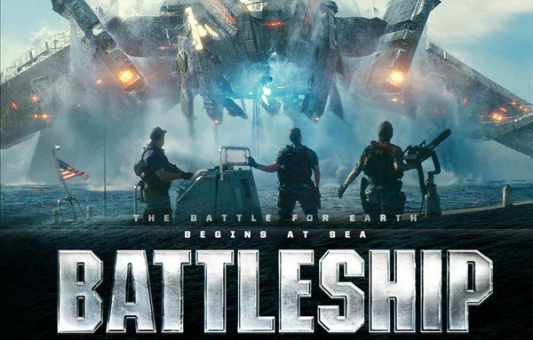
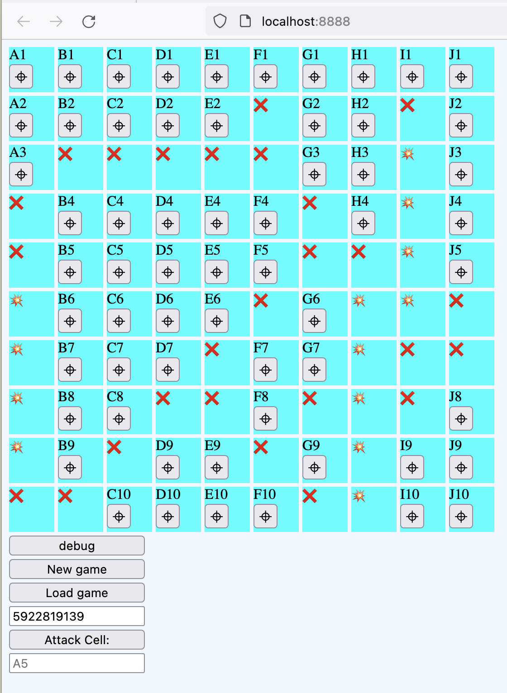

# Battleships



This PHP project demonstrates a simple battleships game.

One player against randomly placed ships:
- 1x Battleships (5 segments long)
- 2x Destroyer (4 segments long)

## Requirements

- PHP `8.2.*`
- Composer
- Running process must have permission to write and read to the operating systems tmp folder.

## To run

This project uses no external packages, but does make use of composer's autoloader.

While in the root folder for this project run:

```bash
composer install
```

Followed by

```bash
composer serve
```

You can then navigate to the sleek and modern gaming interface at <a href="localhost:8888">localhost:8888</a>



Click the 'new game' button to start a new game. This will generate a game id which you can use to return to this game with the 'load game' button.

Clicking the debug button will pour some game state into the console (helps to cheat and see where the ships are).

Click the crosshair buttons in the cells to launch an attack at this square. A red cross indicates a hit. An explosion indicates a hit!

Alternatively type in the cell identifier into the 'attack cell' input and click 'Attack Cell:' to launch an attack with this alternative targeting system.